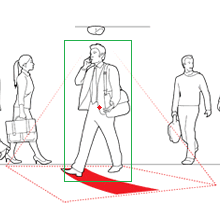

# Proyecto: Detección y reidentificación de personas dentro de secuencias de imágenes o video

## Curso: Estructura de datos

### Integrantes

* Eric Amaya (Coordinador)
* Bastián Trujillo (Planificador)

### Bitácora

[Ver Bitácora](docs/BITACORA.md)

### Resumen

>Para la realización del sistema de vigilancia se crearon tres tipos de clases, “Personas” encargada de contener los atributos de la ubicación de cada persona en la zona escaneada, “Nodos” encargada de crear nodos y también trae y almacena la información de “Personas” en cada uno de los nodos creados, “Detector” que tiene la finalidad de realizar los procedimientos para detectar a las personas y "Requerimiento" la cual, su función es implementar los requerimientos solicitados. Añadido a lo anterior, se generó la lista “ListaPersonas” la cual va almacenando los datos solicitados por la empresa.
>
>La creación de esto permitirá en esta primera entrega detectar personas que pasan por la imagen de video de vigilancia y dibujar un cuadro verde alrededor de ella, en su centro un centroide rojo, también proporciona la habilidad de contar cuantas personas entran por la zona delimitada y cuantas a su vez salen, además se lograr calcular la velocidad con la que entran y salen estas mismas, sumado a un adminitrador el cual puede configurar los archivos y alamacenarlos.

### Documentos

* [Reporte Técnico](docs/README.md)

