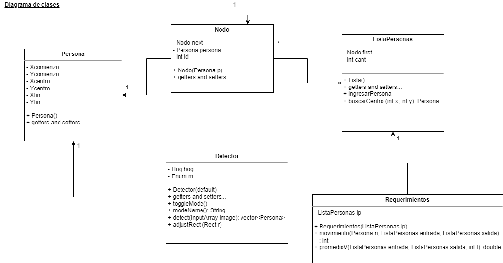
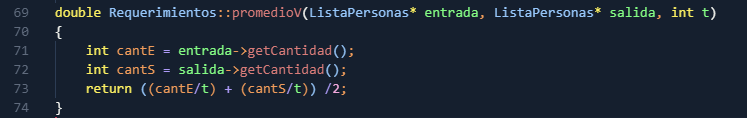
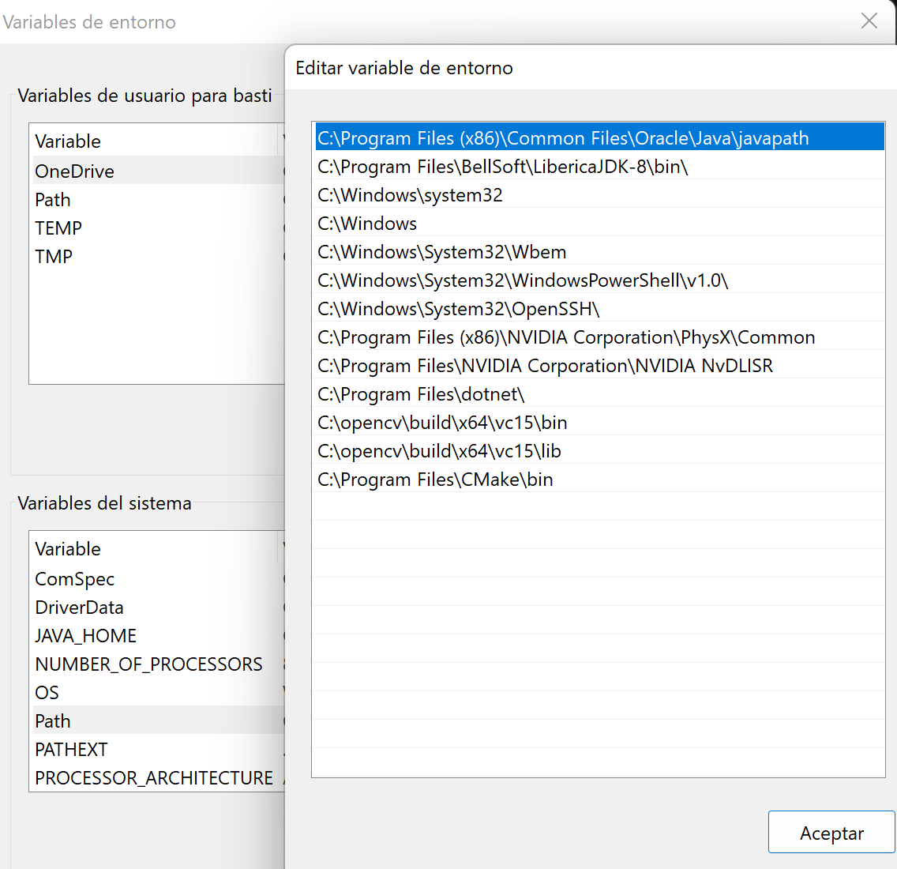
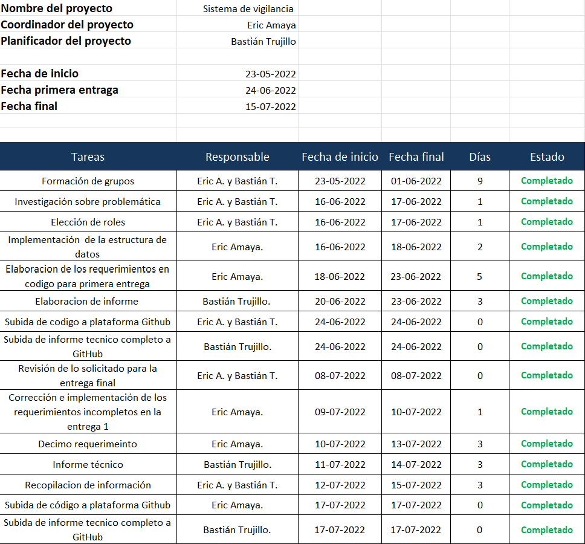
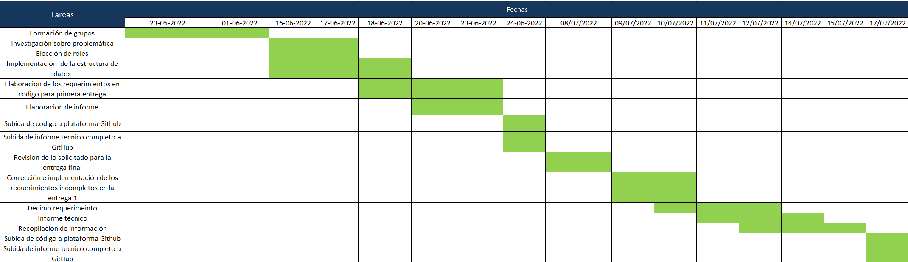

# Informe Técnico 
## Curso: Estructura de datos
### Detección de personas en secuencias de imágenes o video

**Alumnos:**

* Eric Amaya (Coordinador)
* Bastián Trujillo (Planificador)

## Resumen 

>Para la realización del sistema de vigilancia se crearon tres tipos de clases, “Personas” encargada de contener los atributos de la ubicación de cada persona en la zona escaneada, “Nodos” encargada de crear nodos y también trae y almacena la información de “Personas” en cada uno de los nodos creados, y “Detector” que tiene la finalidad de realizar los procedimientos para detectar a las personas. Añadido a lo anterior, se generó la lista “ListaPersonas” la cual va almacenando los datos solicitados por la empresa.
>
>La creación de esto permitirá en esta primera entrega detectar personas que pasan por la imagen de video de vigilancia y dibujar un cuadro verde alrededor de ella, en su centro un centroide rojo, también proporciona la habilidad de contar cuantas personas entran por la zona delimitada y cuantas a su vez salen, además se lograr calcular la velocidad con la que entran y salen estas mismas, además, permite contar cuantas personas diferentes han entrado por aquella zona y cuantas han salido.

## 1. Introducción

Hoy en día se está en una era donde los avances tecnológicos progresan a pasos agigantados y como profesionales y sobre todo como ingenieros de la información y computación es relevante mantenerse actualizado en cuanto a las herramientas que ayudan a agilizar las tareas de las personas.
A pesar de que C++, lenguaje de programación compilado, multiparadigma, principalmente imperativo y orientado a objetos y que evolucionó del lenguaje informático “C”, no es un lenguaje nuevo, hoy en día es sigue utilizándose para realizar programación estructurada de alto nivel y rendimiento, tales como, sistemas operativos, videojuegos, bases de datos, entre otros.
Es por ello que a lo largo del presente trabajo se mostrará la realización de un software que permita a la empresa ACME acceder un sistema de vigilancia que posibilite contar personas en una zona determinada de un edificio de su organización.  Los objetivos del mismo son lograr contar cuantas personas entran y salen dentro de una zona previamente determinada, contar cuantas personas distintas han entrado o salido de la zona y listar las identidades que más han aparecido en el video, tanto en la entrada como en la salida.
Para cumplir con los objetivos anteriormente mencionados se codificará con lenguaje C++ a través del programa Visual Studio Code, editor de código fuente desarrollado por Microsoft. En este se aplicará principalmente lo que son las listas enlazadas, conjunto de nodos, los cuales almacenan 2 tipos de información: dato que contiene y un puntero al siguiente nodo en la lista, terminando con un nodo con el valor NULL. Además el equipo se propuso realizar el programa bajo arboles binarios.
Finalmente, el logro del sistema de vigilancia para la empresa ACME, además de entregarle un sistema moderno y adecuado a sus necesidades, les facilitará la toma de sus datos para el análisis de ellos.

### 1.1 Descripción del problema

La empresa ACME dado a sus pocos avances tecnológicos presenta una dificultad para llevar una correcta cuenta de las personas que entraban y salían de una zona predeterminada, lo cual a llevado además a presentar un problema con el análisis de las personas tales como identificar según las características físicas, frecuencia de cada persona, entre otros. Por lo cual, la empresa ha decidido crear un sistema de vigilancia para tener un conteo de personas, esto lo realizará externalizando esta problemática mediante la contratación de los alumnos de Ingeniería Civil en Computación e Informática de la Universidad Católica del Norte.

### 1.2 Objetivos 

**Objetivo General**

Desarrollar un sistema que identifique y contabilice la cantidad de personas que entren y salgan dentro de una zona previamente determinada.

**Objetivos específicos**

1. Interpretar los resultados obtenidos entre las dos muestras (entrada y salida de la zona).
2. Implementar el lenguaje C++ para elaborar el sistema contador de personas. 
3. Enumerar el total de personas que entran y salen de la zona.
4. Organizar los datos obtenidos dentro de listas.

### 1.3 Solución propuesta

El equipo de trabajo se propone utilizar el lenguaje C++ a través de la IDE Visual Studio Code el cual compilará y ejecutará un código para solucionar la problemática de la empresa ACME, dicho programa detectará a las personas, las almacenarán los datos recopilados y pedidos por la empresa.

## 2. Materiales y métodos

Para el desarrollo del presente trabajo se realizará una planificación a través de un cronograma y el registro de una bitácora para así lograr un avance más ordenado y estructurado.
Este proyecto se elaborará mediante codificación en lenguaje C++, reforzado con la librería OpenCV, utilizando la IDE Visual Studio Code.
En el Anexo C se puede apreciar con detalle el cronograma que se realizó, en el cual se consideró como primera tarea la formación del equipo de trabajo, avanzando hasta la fecha de entrega final. En el anexo C.1 se detalló exactamente la fecha de la tarea, con los dias que tuvieron disponibles para el desarrollo del proyecto y en el anexo C.2 se detalla en forma de tabla el avance logrado por el equipo de trabajo.

### 2.1 Instalación

Como anteriormente se mencionó, se descargó la IDE Visual Studio Code, el cual a través de la librería OpenCV y el apoyo de CMake ejecutará el código que contendrá el sistema de vigilancia.
La librería OpenCV fue descargada desde el explorador y enlazada al sistema del computador mediante la configuración del path en las variables de entorno, el cual buscará directamente los programas a utilizar.
Para el desarrollo del código, se utilizará la IDE Visual Studio Code, la cual se descarga de forma gratuita desde el explorador, el equipo trabajó con la extensión de C/C++ extension pack, el cual puede ser añadido directamente desde Visual Studio Code.
Como modo de apoyo se ocupará CMake que consiste en una herramienta de autotools, dicho de otra forma, es una herramienta de generación o automatización de código.

### 2.2 Diseño 

Se crearán las clases Persona, Nodo y detector, por parte de listas, se generará la ListaPersonas la cual irá almacenando los datos solicitados por la empresa ACME.
Por parte de la clase persona contendrá los atributos de su ubicación en la zona al ser escaneada. por otra parte, la clase Nodo contiene los valores de persona y su id. Finalmente, la clase detector la cual se encargará de realizar todo el procedimiento de detectar a la persona.

### 2.3 Implementación

#### Detector de Movimiento

El detector de movimientos utilizado fue creado para identificar el movimiento de cada persona, en el cual al obtener los valores llevarlos al nodo con la acción de cada persona, ya sea, entrada o salida en forma de conteo. El código para detectar una persona en una imagen se muestra a continuación:

Este método clasifica según el movimiento tomado para cada frame, comparándolo con las personas identificadas anteriormente y clasificando así según el centro de detención si el movimiento es de entrada o salida o si es persona nueva. En la primera parte del código se identifica a la persona  siendo buscada en el nodo, identifica su posición y movimiento, en el primer caso (if(p->getXCentro()-n->getXCentro()) genera la cantidad de personas que salen de la zona y en el caso contrario (else) de entrada y al finalizar busca a otra persona para repetir el proceso.

### Promedio de Velocidad

El promedio de velocidad calcula la velocidad de entrada y salida de cada persona con respecto al tiempo, el cual lo busca según la persona, dependiendo de su entrada y salida y lo relaciona con el tiempo y calcula el flujo promedio de personas. El código para detectar la velocidad y calcularla con respecto al tiempo se muestra a continuación:

En este método se calcula la velocidad para las personas que entren o salgan de una zona predeterminada respecto a un tiempo estableciendo así un flujo de personas. En la primera línea se define la cantidad de entrada igualada al calculo de entrada, en la segunda línea se realiza el mismo procedimiento pero para la salida y en la tercera línea de código se realiza el calculo del fllujo de personas.

## 3. Resultados obtenidos

Dentro de los resultados obtenidos para la primera entrega del equipo, en primer lugar, se logró la selección de la persona demostrada a través de un recuadro verde a su alrededor, también se logró identificarla y hacerle un seguimiento a esta misma persona. Además, su pudo llevar a cabo un conteo de flujo de personas en el área determinada y un manejo de datos obtenidos con el sistema.
Para la entrega final se obtuvo un mejorable avance el equipo, ya que, entregaron finalizado el proyecto propuesto por la empresa ACME, cumpliendo con la rotalidad de los requisitos propuestos.

## 4. Conclusiones

Tal como se puede evidenciar, el equipo de trabajo logró en su totalidad el proyecto solicitado por la empresa, adjunto a esto el informe técnico el cual detalla todo el desarrollo del proyecto, la falencia que tuvo el equipo fue la falta de imagenes o videos para la realización de maás pruebas con el código, pero aún asi el equipo logró concretar el proyecto, además para una mejor eficacia del proyecto el equipo implementó los arboles binarios para la busqueda de los datos.
El equipo destaca su satisfacción con los resultados del proyecto y estiman que la empresa también lo estará.

# Anexos

## Anexo A: Instalación librerías OpenCV

Se descargó la librería OpenCV directamente del navegador en el link que se puede apreciar en la imagen del anexo.

## Anexo B: Instalación de IDE y configuración librerías OpenCV
## Anexo B.1:

## Anexo B.2:

La IDE fue descargada desde el navegador en el link que esta detallado en la imagen, el equipo utilizó el sistema operativo windows (Anexo B.1), además se configuró la librería de OpenCV dentro de la IDE configurando las variables de entorno en el computador (Anexo B.2), a través del path, en él se especifican las rutas en las cuales el intérprete de comandos debe buscar los programas a ejecutar. De forma mas específica y detallada, las rutas que se añadieron fueron las número 11 y 12.

## Anexo C: Cronograma de trabajo
## Anexo C.1: 
## Anexo C.2: 

# Referecia
Ronny Yabar Aizcorbe. Listas enlazadas – Clase Lista,Nodo en c++. https://ronnyml.com/2009/07/04/listas-enlazadas-clase-lista-en-c/#:~:text=Una%20lista%20enlazada%20tiene%20un,siguiente%20nodo%20el%20valor%20NULL.

Frankier Flores. Qué es Visual Studio Code y qué ventajas ofrece. https://openwebinars.net/blog/que-es-visual-studio-code-y-que-ventajas-ofrece/

Escuela de Ingenierías Industriales. El lenguaje c++. https://www2.eii.uva.es/fund_inf/cpp/temas/1_introduccion/introduccion.html#:~:text=lenguaje%20C%2B%2B-,El%20lenguaje%20C%2B%2B,más%20adelante%20en%20el%20curso.

S.A. Qué es c++. https://i.workana.com/glosario/que-es-c/

Adrian Rosebrock. OpenCV People Counter. https://pyimagesearch.com/2018/08/13/opencv-people-counter/

